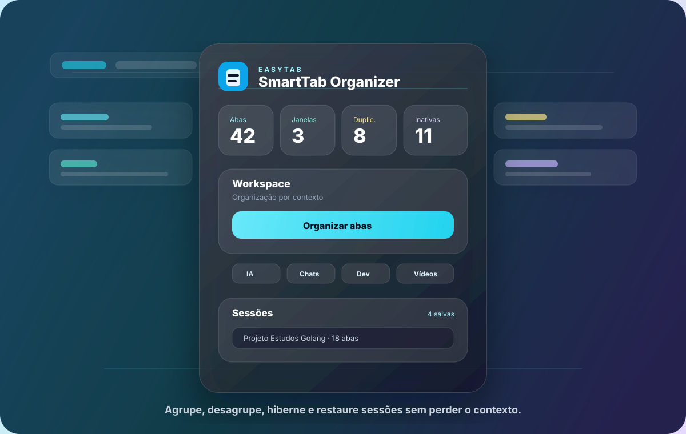

<p align="center">
  
</p>

<h1 align="center">easytab</h1>

<p align="center">
  <strong>O organizador de abas para quem trabalha, pesquisa, codifica, conversa e assiste tudo ao mesmo tempo.</strong>
</p>

<p align="center">
  Pare de caçar abas. Clique uma vez e deixe o Chrome virar um workspace de verdade.
</p>

<p align="center">
  
  
  
  
  
</p>

<p align="center">
  
</p>

---

## A Ideia

**easytab** é uma extensão Chrome para power users que acumulam abas por contexto:

- chats e mensagens;
- vídeos e lives;
- GitHub, localhost e documentação;
- ferramentas de IA;
- e-mail, tarefas, design, cloud, notícias, compras e finanças.

Ela não é só uma popup bonita. A extensão usa APIs reais do Chrome para agrupar, desagrupar, hibernar, salvar e restaurar abas.

## O Problema

Depois de algumas horas de trabalho, o navegador vira uma mistura de:

- uma conversa no WhatsApp;
- três abas do ChatGPT;
- dois PRs no GitHub;
- documentação aberta;
- YouTube em segundo plano;
- Notion, Trello, Gmail;
- um monte de abas que você nem lembra por que abriu.

O Chrome deixa você criar grupos manualmente. O easytab faz isso por você.

## O Que Ele Faz

### Interface Liquid Glass

A popup foi redesenhada para ser rápida de escanear e mais agradável de usar:

- cards compactos para métricas;
- painel principal para ações de workspace;
- prévia inteligente antes de aplicar grupos;
- botões claros para organizar, desagrupar, hibernar, focar e abrir dashboard;
- chips de contexto para IA, chats, desenvolvimento e vídeos;
- painéis separados para duplicadas, abas inativas e sessões.

### Prévia Antes De Organizar

Antes de mexer nas abas, o easytab consegue mostrar uma prévia:

- quantos grupos serão criados;
- quantas abas entram em cada grupo;
- exemplos de abas que caem em cada contexto;
- em quais janelas a organização será aplicada.

Depois disso, você aplica os grupos com um clique.

### Organiza Abas Por Contexto

O botão **Organizar abas** lê as abas abertas, calcula o contexto de cada uma e cria grupos visuais usando `chrome.tabGroups`.

A lógica atual usa domínio, URL, título e palavras-chave para classificar melhor:

| Grupo | Exemplos |
| --- | --- |
| **IA** | ChatGPT, Claude, Gemini, Perplexity, Copilot |
| **Chats** | WhatsApp, Telegram, Discord, Slack, Teams, Meet, Zoom |
| **Desenvolvimento** | GitHub, GitLab, Stack Overflow, localhost, CodeSandbox |
| **DevOps & Cloud** | Vercel, AWS, Google Cloud, Azure, Supabase, Firebase, Sentry |
| **Documentação** | MDN, npm, React, TypeScript, Node, Tailwind, docs |
| **Aprendizado** | Udemy, Coursera, freeCodeCamp, Alura, tutoriais |
| **Vídeos** | YouTube, Twitch, Vimeo, lives, shorts |
| **Design** | Figma, Canva, Dribbble, Behance, Framer |
| **Produtividade** | Notion, Trello, Linear, Jira, Asana, ClickUp, Calendar |
| **E-mail** | Gmail, Outlook, Proton, Yahoo Mail |
| **Redes sociais** | X/Twitter, LinkedIn, Instagram, Facebook, Reddit |
| **Notícias** | G1, BBC, CNN, UOL, NYTimes, Medium |
| **Compras** | Amazon, Mercado Livre, Shopee, AliExpress |
| **Finanças** | bancos, corretoras, crypto, wallets, PayPal |

Abas que não batem em uma categoria forte são tratadas com mais cuidado:

- se houver várias abas do mesmo domínio, o easytab cria um grupo `Outros: dominio.com`;
- se for uma aba solta sem contexto claro, ela pode ficar sem grupo para evitar bagunça artificial.

### Desativa Agrupamento

Não gostou da organização? Clique em **Desativar agrupamento**.

A extensão remove as abas dos grupos atuais com `chrome.tabs.ungroup`, sem fechar nada e sem perder suas abas.

### Modo Foco

O **Modo foco** cria um fluxo de trabalho mais fechado:

- salva automaticamente a sessão atual;
- organiza o workspace;
- hiberna abas inativas;
- abre uma tela de foco com timer de 25 minutos;
- exibe um ninja 2D meditando com animação fluida em SVG/CSS;
- permite reiniciar o ciclo, abrir o dashboard ou sair do foco fechando a aba.

O ninja é um asset code-native, leve e versionado no próprio código, animado por camadas: flutuação, respiração, aura, faixa, mãos, energia, fumaça, olhos e partículas.

<p align="center">
  
</p>

### Dashboard Completo

Além da popup, o easytab tem uma página interna de dashboard com:

- busca global por abas abertas;
- busca dentro de sessões salvas;
- visão da prévia inteligente;
- ações rápidas para organizar, hibernar, fechar duplicadas e iniciar foco;
- restauração e exclusão de sessões.

### Regras E Perfis

Nas opções, você pode ajustar a inteligência da extensão:

- escolher perfil: **Balanceado**, **Modo Dev**, **Pesquisa** ou **Foco**;
- criar regras personalizadas por domínio, URL ou título;
- forçar uma categoria específica para ferramentas próprias, clientes ou projetos;
- manter domínios ignorados fora da automação.

### Detecta Duplicadas

O easytab encontra abas com a mesma URL e mostra os grupos duplicados.

Você pode fechar as duplicadas automaticamente. A extensão mantém a aba ativa ou a mais recente.

### Hiberna Abas Inativas

Abas antigas e pesadas podem ser hibernadas.

Quando isso acontece, a aba vira uma página interna da extensão com:

> Esta aba foi hibernada para economizar memória.

E um botão para restaurar a URL original.

Você pode:

- hibernar todas as abas inativas;
- selecionar manualmente quais abas inativas serão hibernadas;
- configurar o tempo de inatividade.

### Salva Sessões Por Projeto

Salve seu contexto inteiro com nome de projeto:

- Projeto Remape
- Estudos Golang
- Pesquisa YouTube Shorts
- Trabalho Cliente X

Cada sessão guarda:

- nome;
- lista de abas;
- data de criação;
- última restauração;
- quantidade de abas.

Também é possível restaurar, renomear e excluir sessões.

## Dashboard

A popup mostra:

- total de abas abertas;
- quantidade de janelas;
- duplicadas encontradas;
- abas inativas;
- botão para organizar;
- botão para desativar agrupamento;
- botão para salvar sessão;
- botão para fechar duplicadas;
- botão para hibernar abas.

## Opções

A tela de opções permite configurar:

- tempo para considerar aba inativa;
- perfil de organização;
- regras personalizadas;
- agrupamento automático;
- hibernação automática;
- domínios ignorados;
- exportação de dados em JSON;
- importação de dados em JSON;
- limpeza de dados salvos.

## Stack

- Chrome Extension Manifest V3
- TypeScript
- React
- Vite
- Tailwind CSS
- lucide-react

APIs do Chrome:

- `chrome.tabs`
- `chrome.tabGroups`
- `chrome.storage`
- `chrome.runtime`
- `chrome.alarms`

## Estrutura

```txt
src/
  background/
    service-worker.ts
  popup/
    Popup.tsx
    main.tsx
  options/
    Options.tsx
    main.tsx
  dashboard/
    Dashboard.tsx
    main.tsx
  focus/
    FocusMode.tsx
    main.tsx
  pages/
    HibernatePage.tsx
    main.tsx
  utils/
    duplicates.ts
    runtime.ts
    sessions.ts
    storage.ts
    tabClassifier.ts
  types/
    index.ts
public/
  manifest.json
  icons/
    icon.svg
    icon16.png
    icon32.png
    icon48.png
    icon128.png
```

## Rodando Localmente

```bash
npm install
npm run dev
npm run build
```

O build de produção fica em:

```txt
dist/
```

## Instalando No Chrome

1. Rode `npm run build`.
2. Abra `chrome://extensions`.
3. Ative **Modo do desenvolvedor**.
4. Clique em **Carregar sem compactação**.
5. Selecione a pasta `dist`.

## Status

Implementado:

- Manifest V3.
- Popup real da extensão.
- Service worker.
- Agrupamento inteligente por contexto.
- Prévia de organização antes de aplicar.
- Desativação de agrupamento.
- Dashboard completo com busca global.
- Modo foco com ninja 2D meditando.
- Regras personalizadas e perfis de organização.
- Detecção e fechamento de duplicadas.
- Hibernação de abas inativas e selecionadas.
- Página interna de restauração de aba hibernada.
- Sessões por projeto.
- Opções com persistência em `chrome.storage.local`.
- Importação e exportação JSON.
- Logo e ícones da extensão.

## Build

```bash
npm run build
```

Esse comando executa:

- `tsc --noEmit`
- `vite build`

## Roadmap

- Regras customizadas por usuário.
- Editor visual de categorias.
- Busca dentro das sessões.
- Atalhos de teclado.
- Estatísticas por domínio.
- Exportação em Markdown.
- Perfis de organização por tipo de trabalho.
- Sincronização opcional entre máquinas.

## Contribuindo

Abra uma issue com uma regra de classificação que você gostaria de ver.

Exemplo:

```txt
Domínio: app.minhaferramenta.com
Categoria sugerida: Produtividade
Motivo: ferramenta de tarefas para times
```

Quanto melhores forem as regras, mais inteligente o easytab fica.

## Licença

MIT
